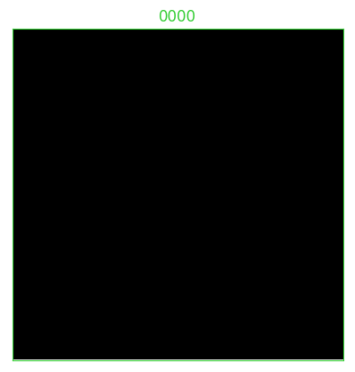

# **Multi-Track PF**
*Tracking multiple objects with systematic re-sampling particle filtering*

As with so many useful or beneficial innovations encountered in life, once I see a simplified example in action, I become confident that I can adapt it to a problem that I'm trying to solve. Often when I need to track objects in video, the object can be detected based on pixel intensities, local structure, learned features, etc. For example, in the case of an unresolved object, it might appear in an sensor's image as only a small blob, but it can be detected by its disc-like shape, or the relative high intensity of the pixels in the disk region. However, there are some cases when we would like to note the presence of the object at an even greater distance, when the signal-to-noise is so low that our eyes might even overlook it if we did not know just where in the image to look. There are a few very skilled engineers who can design and implement these wonderful algorithms. If you are interested, then search online for descriptions of "track-before-detect" algorithms using particle filters and you can get the general idea.

I have not been able to find one of these beauties implemented in Python. If you know of one, I'd love to get a copy to learn how it works. (I'd take a C++ implementation too!) Most of the technical papers about track-before-detect algorithms are behind journal paywalls, but I have the feeling that even if I had the paper, instead of the code to play with, my eyelids would grow heavy soon after reading the abstract. I'd get frustrated trying to follow the math involving matrices with several indices and I wouldn't know any more than before I began.

At this point I began looking for a textbook to purchase but fortunately discovered Roger R. Labbe's online book *Kalman and Bayesian Filters in Python* found here: https://github.com/rlabbe/Kalman-and-Bayesian-Filters-in-Python. When I read his *Motivation* section at the beginning of the book, I realized that he understood the frustrations that the non-specialist is likely to encounter when picking up filtering textbooks or published papers. When I read that his book addresses these difficulties with interactive exercises and that the only required dependency to my usual Python + NumPy environment is his own library FilterPy (https://github.com/rlabbe/filterpy), I knew this was the book for me.

 

