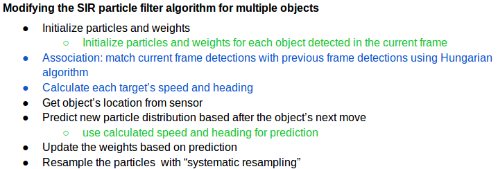
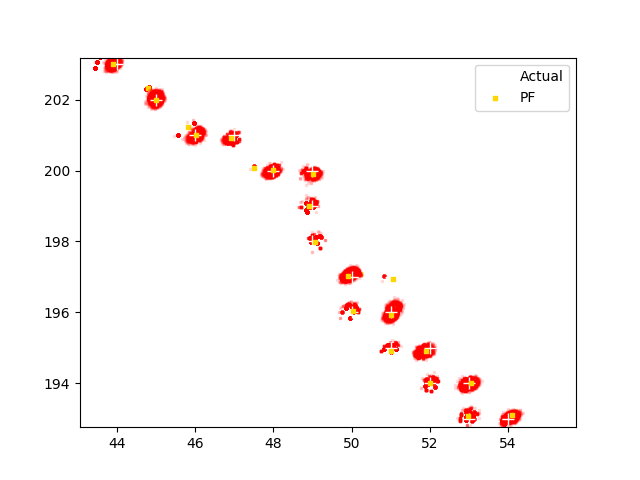

## **Multi-Object Tracking with Particle Filters**
*Tracking multiple objects with systematic re-sampling particle filtering*

An unresolved object might appear in an sensor's image as only a small blob, but it can be detected by its disc-like shape, or the relative high intensity of the pixels in the disk region. However, there are some cases when we would like to note the presence of the object at an even greater distance, when the signal-to-noise is so low that our eyes might even overlook it if we did not know just where in the image to look. There are a few very skilled specialists who can design and implement these wonderful algorithms. If you are interested, then search online for descriptions of "track-before-detect" algorithms using particle filters and you can get the general idea.

I have not been able to find one of these beauties implemented in Python. If you know of one, I'd love to get a copy to learn how it works. (I'd take a C++ implementation too!) Most of the technical papers about track-before-detect algorithms are behind journal paywalls, but I have the feeling that even if I had the paper, instead of the code to play with, my eyelids would grow heavy soon after reading the abstract. I'd get frustrated trying to follow the math involving matrices with several indices and I wouldn't know any more than before I began.

I began learning of filtering methods through Udacity's free course **_Artificial Intelligence for Robots_** (https://classroom.udacity.com/courses/cs373), taught by Sebastian Thrun himself. After this, I began looking for a textbook to purchase but fortunately discovered Roger R. Labbe's online book **_Kalman and Bayesian Filters in Python_** found here: https://github.com/rlabbe/Kalman-and-Bayesian-Filters-in-Python. When I read his *Motivation* section at the beginning of the book, I realized that he understood the frustrations that the non-specialist is likely to encounter when picking up filtering textbooks or published papers. When I read that his book addresses these difficulties with interactive exercises and that the only required dependency to my usual Python + NumPy environment is his own library **FilterPy** (https://github.com/rlabbe/filterpy), I knew this was the book for me. The chapter on Particle Filters, chapter 12, describes the Sampling Importance Resampling filter and implements the code for tracking a single object. I began with this example, adapting the code to fit my requirements.
 
#### A Multi-track Particle Filter 
 
Below is an outline of the SIR Particle Filter found in Chapter 12 along with my additions and modifications to track multiple objects. The bullets in black are from the original implementation in the book. The green sub-bullets are my modifications, and the blue bullets are my additions made to track multiple objects moving with non linear motion.

 
The file **testPF_3objs.py** is the implementation of the algorithm described above. To test the performance, three target tracks are read from the input directory. These locations were generated by saving the pixel locations of the mouse cursor moved in an 250x250 grid. The mouse movement capture program only records integer x,y locations and appears to "jump" back and forth by one pixel. These erratic looking tracks provide the non linearity needed for testing the algorithm. Note that this first test is a relatively simple one; it does not involve new tracks being spawned, tracks dying, obscuration of objects, or objects passing close together. The GIF at the beginning and the image below were output by the code. In the GIF, the true object positions are shown with blue +'s whilst the squares denote the tracked locations. To make test that the code would be robust in the face of occasional spurious tracks, I intentionally shifted the input location for two of the objects in four of the frames. These frames can be identified by the white pixels appearing away from the tracked locations. Notice that the tracked locations do not jump away from the true trajectory, indicating that the code behaves as desired.

